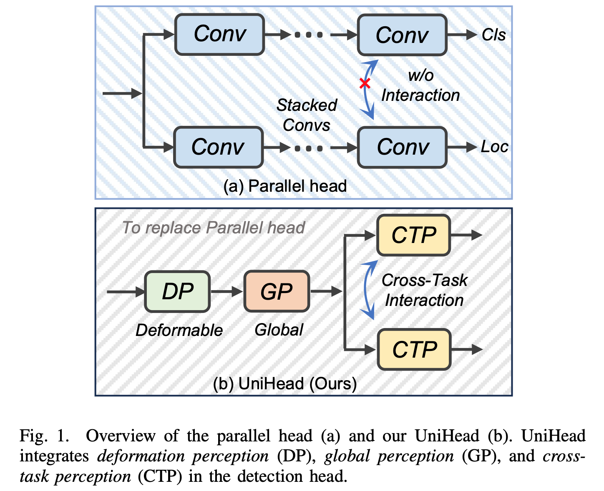
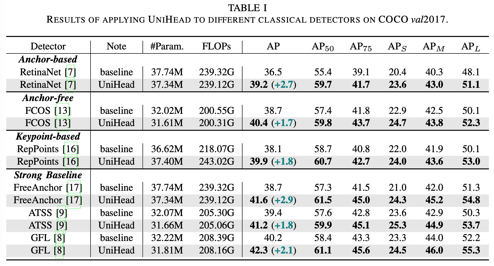
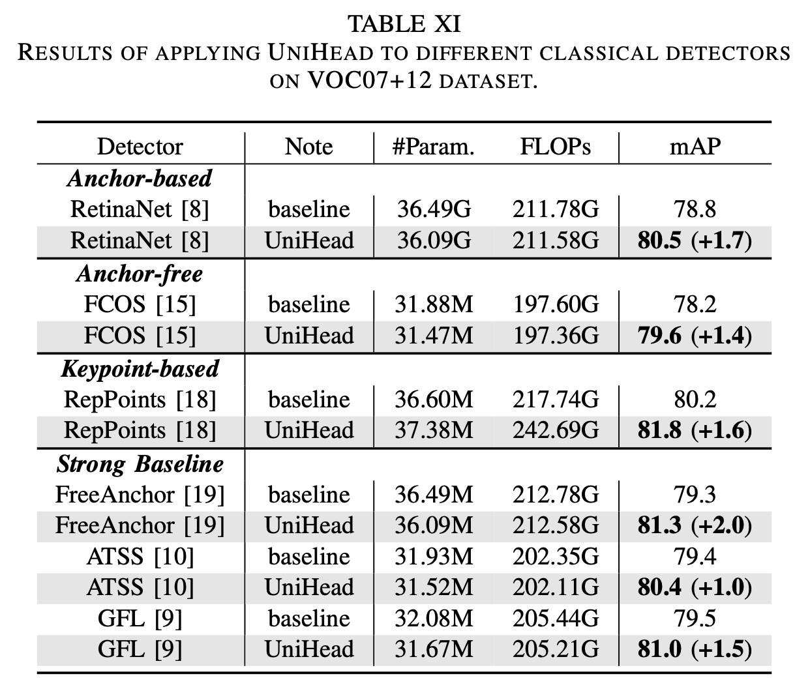
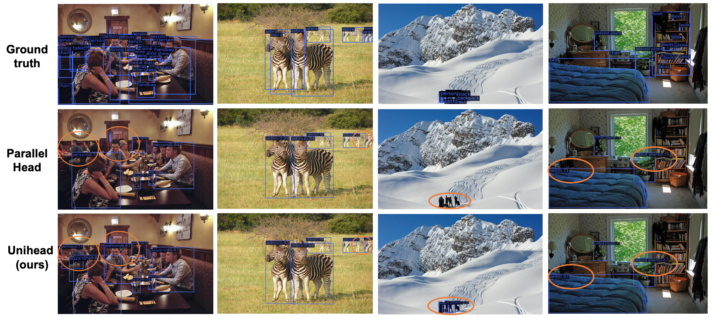

# UniHead: an effective detection head

## :loudspeaker: Introduction
This is the official implementation of our paper titled "UniHead: Unifying Multi-Perception for Detection
Heads".

For more details, please refer to our [paper](https://arxiv.org/pdf/2309.13242.pdf). This repo is based on PyTorch>=1.7.1 and mmdet==2.25.1.



## :trophy: Result
Our UniHead can bring significant AP improvements to a large number of detectors, even with lower model complexity.



**New!!!** We evaluate our UniHead on the VOC07+12 dataset. We find that our UniHead is also effective, demonstrating the generalization ability of UniHead.


## :open_file_folder: Weight
We release the weight of models used in our paper, including RetinaNet, FCOS, RepPoints, FreeAnchor, ATSS and GFL.  **You may need to log out of your Google account to download them.**

Download the weight(s) from corresponding links below.
 - RetinaNet-UniHead (39.2 AP): [Google Drive](https://drive.google.com/file/d/1iouS_uP0O6h39ZLafJhxw9CzZnPAasD3/view?usp=drive_link); [BaiduNetDisk](https://pan.baidu.com/s/1kNz784AJa57VpyTbs-fEXw?pwd=hrzu)

  - FCOS-UniHead (40.4 AP): [Google Drive](https://drive.google.com/file/d/1UNzChmpBffOHwbXZDCaz8ou3Oz_WPgY2/view?usp=drive_link); [BaiduNetDisk](https://pan.baidu.com/s/1gBsxBDIdlcbkI7-gptd51Q?pwd=jieu)

  - RepPoints-UniHead (39.9 AP): [Google Drive](https://drive.google.com/file/d/1I8whN9bz3412zj90qdyGF8LYH0mgZ4Sl/view?usp=drive_link); [BaiduNetDisk](https://pan.baidu.com/s/1NGCsISSRVieC0TfKTL196w?pwd=2t2c)

  - FreeAnchor-UniHead (41.6 AP): [Google Drive](https://drive.google.com/file/d/1Vz5OBrrZHgpLZVw_uQjPsJOLmIAihIRb/view?usp=drive_link); [BaiduNetDisk](https://pan.baidu.com/s/1D4E35grbOB-Za7pnj_jr3Q?pwd=9vsf)

  - ATSS-UniHead (41.2 AP): [Google Drive](https://drive.google.com/file/d/1v9Nq0uJQ_cAyeZZ6_YQm5NYko5AVaLMT/view?usp=drive_link); [BaiduNetDisk](https://pan.baidu.com/s/16n_vF9l5eFSPaW4PaPJ2dg?pwd=p3wi)

  - GFL-UniHead (42.3 AP): [Google Drive](https://drive.google.com/file/d/1W_Qjbt5c1DS-LpyHIyHpBV-dPu-fESyq/view?usp=drive_link); [BaiduNetDisk](https://pan.baidu.com/s/1-dFLWBPuxzW8pyFcmRQn_A?pwd=2m5g)

The weights of UniHead with various of backbones (R101 and SwinT) are also released. If you need more models, such as UniHead-SwinB, please feel free to contact me via email.

  - UniHead-R101-2x-MS (47.7 AP): [Google Drive](https://drive.google.com/file/d/1yxLkTc-JZqTf7X3EHDZxr6D_EaiKdFch/view?usp=drive_link); [BaiduNetDisk](https://pan.baidu.com/s/1Ph2zoXntVQjk93apjqTDgw?pwd=t5pj)

  - UniHead-SwinT-3x-MS (51.3 AP): [Google Drive](https://drive.google.com/file/d/16r_l8qkIJXYmlizI-qfqyoERYyeAExnG/view?usp=drive_link); [BaiduNetDisk](https://pan.baidu.com/s/1F1-McR4axFIIy-3Zsvalrw?pwd=wbtj)

## 🚀 Training
More detail please see [mmdetection](https://github.com/open-mmlab/mmdetection).
```
bash dist_train_UniHead.sh
```

## :ferris_wheel: Visualization

Examples of detection results obtained by our UniHead and baseline (RetinaNet).


## 📚  Citation
Please cite our work if you find our work and codes helpful for your research.
```
@article{zhou2024unihead,
  title={Unihead: unifying multi-perception for detection heads},
  author={Zhou, Hantao and Yang, Rui and Zhang, Yachao and Duan, Haoran and Huang, Yawen and Hu, Runze and Li, Xiu and Zheng, Yefeng},
  journal={IEEE Transactions on Neural Networks and Learning Systems},
  year={2024},
  publisher={IEEE}
}
```

## Acknowledgement

This project is built upon numerous previous projects. We'd like to thank the contributors of [mmdetection](https://github.com/open-mmlab/mmdetection).
